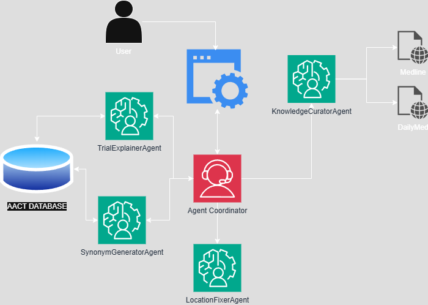

# Clinical Trial Agent Seekers Have Entered The Chat


## 🔍 What's This All About?

An intelligent agent-powered system that connects patients with relevant clinical trials based on their condition and location, providing plain language explanations of trials and educational resources about their condition.

**Created for the 2025 Microsoft AI Agents Hackathon** 🏆

## ✨ Key Features

### 1. Intelligent Trial Matching
- Enter your condition and our agents generate clinically relevant synonyms
- We find trials that match your condition through semantic similarity
- Results are sorted by geographic distance - because nobody wants to drive 5 hours for a clinical trial

### 2. Study Simplification
- Clinical trials documentation is... complex. Our agents translate it into human speak
- Get plain language explanations of:
  - What the trial is actually studying
  - Who can participate (eligibility criteria)
  - What participating would involve
  - The potential benefits and risks

### 3. Knowledge Hub
- Learn about your condition with curated educational resources
- Understand standard treatments and new approaches
- Find support organizations and communities
- See the bigger picture of research in your condition


## 🛠️ Tech Stack

- **Frontend**: Streamlit
- **Data Source**: [AACT Database](https://aact.ctti-clinicaltrials.org/), [DailyMed](https://dailymed.nlm.nih.gov/dailymed/),[Medline](https://medlineplus.gov/) 
- **Geospatial**: GeoPy
- **Intelligent Agents**: Azure Open AI 
- **Visualization**: Folium
- **Deployment**: Docker, Azure Container Apps

## 👩‍💻 Local Development

### Prerequisites
- Python 3.10+
- Docker
- AACT Database credentials

### Quick Start

```bash
# Clone the repository
git clone https://github.com/sharder14/clinical_trial_agent_seekers_have_entered_the_chat.git
cd clinical_trial_agent_seekers_have_entered_the_chat

#Create a data folder
mkdir data

# Set up environment
python -m venv venv
source venv/bin/activate  # On Windows: venv\Scripts\activate
pip install -r requirements.txt

# Set up environment variables
cp .env.example .env
# Edit .env with your credentials

#To generate the synonyms data file 
python scripts/study_condition_embeddings_init.py #On Windows scripts\study_condition_embeddings_init.py

# Run the application
streamlit run app.py
```

## 🔮 Architecture

Our system uses three specialized agents:

1. **Synonym Generator Agent** - Expands condition terms to relevant medical equivalents
2. **Location Fixer Agent** - Generates / Fixes User input string locations to accurate United States City, State 
2. **Trial Explainer Agent** - Translates complex trial information into accessible language
3. **Knowledge Curator Agent** - Assembles condition-specific educational resources




## 🚀 Deployment

The deployment to Azure Container Apps is currently in progress. For information about endpoints or deployment status, please contact the owners of this repository.

## 🤝 Contributing

This project was created during a hackathon. If you'd like to contribute:

1. Fork the repository
2. Create a feature branch
3. Make your changes
4. Submit a pull request

## 📜 License

MIT License - See LICENSE file for details.

## 📣 Acknowledgements

- Aggregate Analysis of ClinicalTrials.gov (AACT) Database. Clinical Trials Transformation Initiative (CTTI). Available at: https://aact.ctti-clinicaltrials.org/
- DailyMed https://dailymed.nlm.nih.gov/dailymed/
- MedlinePlus https://medlineplus.gov/

---

> "The trial agents have officially entered the chat and they understood the assignment" - Hackathon Judge, probably